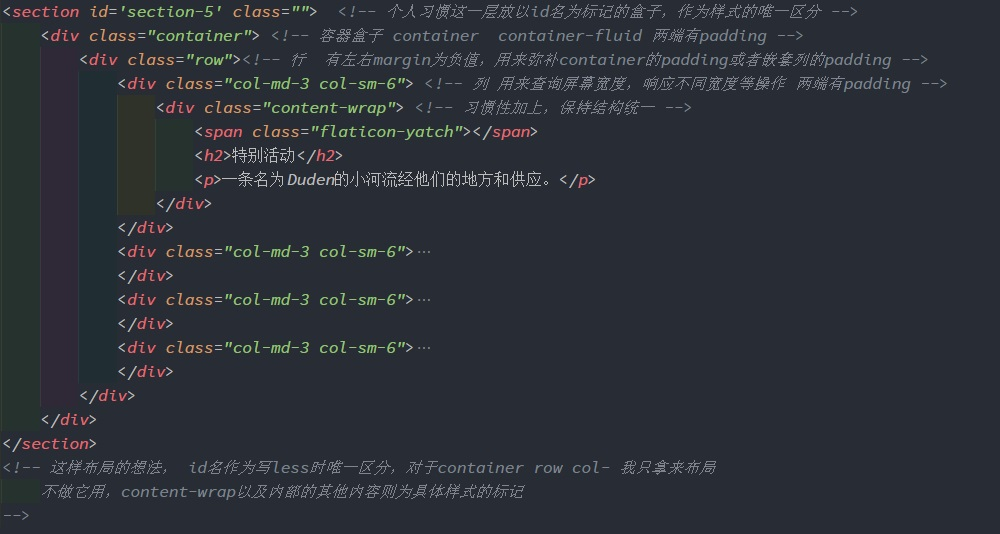

# 此项目个人总结

## 开发步骤
&emsp;1.首先使用模版，其中必须加上 
`<meta name="viewport" content="width=device-width,initial-scale=1.0,minimum-scale=1.0,maximum-scale=1.0,user-scalable=no" />`
 
&emsp;2.在style中引入bootstrap.css核心样式库
        此css底层是用less进行原型开发，最著名的栅格系统则是用less的递归循环写的
        内部包含有许多混合和css组件，比如normalize等等样式重置
 
&emsp;3.在body中引入jQuery.js(bootstrap.js用的jQuery的语法)
 
&emsp;4.在body中引入bootstrap.js
    
&emsp;[官方模版见:https://v3.bootcss.com/getting-started/#template](https://v3.bootcss.com/getting-started/#template)
    
## viewport标签的必须性（移动端开发重点）
&emsp;运用Bootstrap这种UI框架做三端开发，虽然Bootstrap是以移动端优先，但是对移动端的技术点体现不强烈，因为框架做好了。 
&emsp;比如: 
- 视口理论， 
- 像素理论， 
- 移动端适配方案  （百分比适配，rem适配，viewport适配等）

&emsp;可视区域的定义，如屏幕缩放等。告诉浏览器如何规范的渲染网页 
&emsp;`<meta name="viewport" content="width=device-width,initial-scale=1.0,minimum-scale=1.0,maximum-scale=1.0,user-scalable=no" />`

- width=device-width  css宽度等于设备宽度，提供了css像素与设备独立像素的接口，让程序员能准确通过css像素操作布局大小。
- initial-scale=1.0,minimum-scale=1.0,maximum-scale=1.0  一套
    initial-scale=1.0初始化比例为零
    minimum-scale=1.0,maximum-scale=1.0 保证初始化比例为零，个别浏览器不支持initial-scale=1.0,
- user-scalable=no  不允许用户缩放

- 对viewport标签的详细理解： 
[https://www.jianshu.com/p/641589d0d975](https://www.jianshu.com/p/641589d0d975)

## Bootstrap
    Bootstrap的重难点在栅格系统，核心是媒体查询。

## 个人对栅格系统的理解
    纵观各个UI库，有栅格的系统的感觉都雷同，均是利用less等css预处理语言递归循环写出样式，看完源码后发现自己也有提取栅格系统的能力，哈哈哈。

    栅格系统主要用于响应式布局
        其中  
        container container-fluid两种容器为内置的两种容器，已经可以用于大多数的开发需求，也可以自定义容器
            **container-fluid 流式容器 始终占据100%
            **container 固定容器  根据视口大小，分别有不同的宽度
        row:行，只有margin-left=-15px   margin-right=-15px 两个样式
        col:列，根据视口响应不同宽度，移动端优先，源码是将小屏写在前，大屏触发后覆盖小屏样式
            通常我用
                col-md-* col-sm-*
                col-lg-*会与col-md-*状态一致 
                col-xs  默认满屏
            列嵌套：必须用row包含col，防止槽宽叠加  用于调整块的大小
            列偏移：col-md-offset-* 调整margin-left 用于调整块的位置
            列排序：col-md-pull-* col-md-push-* 调整的是relative的right，left， 用于调整谁先掉下来

利用栅格系统布局（常用布局）
 
**栅格盒模型设计的精妙之处**  
- 其中对内外填充及布局的理解 
    因为在设计之初有槽宽设定，两端padding=15px 槽宽默认即为30px 
    col有内填充，在嵌套列的时候，为了避免col直接嵌套会导致槽宽叠加，
    通过row的margin=-15px 去抵消上一层col的padding，也导致了
    container，container-fluid两端必须有padding=15px 去包住最外层row

## 媒体查询
    可以自定义一些响应式样式

## 对于bootstrap内置的样式，组件的使用
    个人认为，很多内置样式太鸡肋，所以官网也提供了自定义简洁bootstrap的功能
        全局css样式部分： 
            重点用好 栅格系统 ，响应式工具也可以用一下
            其余的表格，表单，按钮内置样式，什么改个背景，改个大小的，鸡肋！！！
        组件部分：
            在开发过程中可以打开根据情况选择或自己写
        JavaScript插件部分：
            在开发过程中可以打开根据情况选择或自己写

